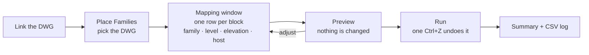

# CAD2Revit Family Mapper

[](https://github.com/ahmedel0865-lab/CAD2Revit-Family-Mapper/actions/workflows/build.yml)


**Turn the blocks in a linked DWG into real Revit families, in one window.**
Built for electrical / MEP shop drawings (lighting, power, fire alarm, ELV). It's a standalone Revit add-in, so no pyRevit, Dynamo or Excel is needed.

Instead of placing hundreds of light fixtures, sockets and detectors by hand over a CAD background, you map each CAD block to a Revit family type once. The tool places every instance at the right location, rotation, level and height, hosted on ceilings, walls or reference planes as you choose.



## Contents
- [The CAD2Revit ribbon](#the-cad2revit-ribbon)
- [Features](#features)
- [Requirements](#requirements) · [Installation](#installation) · [Quick start](#quick-start)
- [Ceiling vs Reference Plane](#ceiling-vs-reference-plane-which-host-to-use)
- [Mapping file](#mapping-file) · [Project structure](#project-structure) · [Building from source](#building-from-source)
- [Limitations](#limitations-short) · [Roadmap](#roadmap)
- Guides: [Usage](docs/USAGE.md) · [Testing on a sample](docs/TESTING.md) · [Limitations](docs/LIMITATIONS.md) · [Changelog](CHANGELOG.md)

## The CAD2Revit ribbon

| Panel | Button | What it does |
|---|---|---|
| Mapper | **List Blocks** | Lists every block in a DWG by category, with counts, and exports a mapping template. |
| Mapper | **Place Families** | Pick the DWG, then map, preview and place everything in the mapping window. |
| Tools | **Settings** | Opens `settings.ini` (tolerances, host search distances, fallbacks) in Notepad. |
| Tools | **Help** | Version, user guide, and quick links to the logs and the saved project mappings. |

## Features

**Mapping window**
- One row per unique CAD block (e.g. `SMOKE-DET (42)`), **grouped by category**: Electrical, Mechanical, Plumbing, Architectural, Structural, Annotation, Other.
- **Find** box and **Show** filter; **Skip shown rows** hides e.g. all architectural blocks in one click.
- **Searchable family dropdown** (electrical categories): type part of a name to filter.
- **Auto-selects** families whose names match the block name (`SMOKE-DET` → *Smoke Detector*), including common CAD abbreviations.
- **Level + elevation per row**: different blocks can go on different levels in one run.
- **Edit many rows at once**: select rows (Ctrl/Shift+click, Ctrl+A) and set Host Type, Level, Elevation, Facing or Category together.
- Groups the per-instance block names of **DWGs exported from Revit** (`Family - Type-<id>-<view>`) into one row per type.
- **Remembers the last mapping per project**; Load / Save mappings as **.xlsx or .csv**.

**Placement and hosting**
- Places families at the block insertion points with the CAD rotation (plus a per-row adjustment). DWG units, link position, rotation and shared coordinates are handled automatically.
- Hosts per row: **None (level-based)**, **Ceiling**, **Wall**, **Reference Plane (auto-create)**, **Face** (ceilings/slabs/roofs/beams) or **Vertical plane** (no wall needed), including hosts in linked Revit models.
- **Reference Plane (auto-create)**: named horizontal planes at level + elevation (e.g. `CAD2Revit_Level 1_+2800mm`), shared per elevation, facing Down or Up.
- If no host is found, falls back to unhosted placement (or reports a failure, your choice).

**Safety and output**
- **Preview** runs the full placement and undoes it, so its counts match a real run.
- **Duplicate protection** per level: re-running only adds new blocks.
- **One transaction**: a single Ctrl+Z undoes a whole run.
- Summary per family type, unmapped blocks and failures with reasons; a **CSV log** of every block with Element ID, level, host, coordinates and rotation.
- Writes `CAD: <block name>` into each element's Comments, for filters and schedules.

## Requirements
- Autodesk Revit **2022, 2023, 2024, 2025 or 2026** on Windows
- Nothing else: no pyRevit, no Dynamo, no Excel

## Installation
1. Download **`CAD2Revit-<version>.zip`** from the [download](download/) folder, the [Releases](https://github.com/ahmedel0865-lab/CAD2Revit-Family-Mapper/releases) page, or the latest run in the [Actions](https://github.com/ahmedel0865-lab/CAD2Revit-Family-Mapper/actions) tab (*Artifacts*).
2. Close Revit, unzip, and double-click **`Install.bat`**. It installs for every Revit 2022–2026 on the PC, for the current user; no admin rights are needed.
3. Start Revit and click **Always Load** when asked about the add-in. A **CAD2Revit** tab appears.

Uninstall: `Uninstall.bat`. Manual install and details: [docs/USAGE.md](docs/USAGE.md#0-install-once).

## Quick start
1. Load your families (face-based for hosted devices) and link the DWG in the target floor plan.
2. **CAD2Revit > Place Families** > pick the DWG > **Next**.
3. In the mapping window, pick a family for each CAD block (type to search; close matches are pre-selected), set the level, elevation and Host Type (see [Ceiling vs Reference Plane](#ceiling-vs-reference-plane-which-host-to-use)). To set many rows at once, select them (Ctrl/Shift+click, Ctrl+A) and use *Apply to selected rows*; and leave `(Skip)` for blocks you don't want.
4. **Preview** > check the result > **Run**. One Ctrl+Z undoes it all.

Next time in the same project, the mapping window opens pre-filled.

- Full guide: [docs/USAGE.md](docs/USAGE.md)
- Test on a small sample first: [docs/TESTING.md](docs/TESTING.md)
- Known limitations: [docs/LIMITATIONS.md](docs/LIMITATIONS.md)
- Example mapping: [templates/mapping_template.xlsx](templates/mapping_template.xlsx) / [.csv](templates/mapping_template.csv)

## Ceiling vs Reference Plane: which host to use?

| Use **Ceiling** when... | Use **Reference Plane (auto-create)** when... |
|---|---|
| The model (or a linked architectural model) **has ceilings** at the right height. | There are **no ceilings** yet, or they are in a model you can't host on (e.g. a DWG background only). |
| You want devices to **follow the ceiling**: if the architect moves the ceiling, hosted lights and detectors move with it. | You want a **fixed height** from the level that you control, e.g. 2800 mm for all lights on Level 1, regardless of the architecture. |
| Ceilings are at different heights in different rooms, and each device should sit on its own ceiling. | Many devices share one height and you want **one tidy plane per height** that you can move later (moving the plane moves every device on it). |
| | Devices go on the **underside of a slab** or in **open ceilings** (car parks, plant rooms), or **face up** on the floor (floor boxes: set *Facing* = Up). |

Notes:
- Both need **face-based** (or work-plane-based) families. A level-based family set to Reference Plane is placed level-based at the elevation, with a warning in the log and the result window.
- Ceiling hosting looks straight up from each block and needs a ceiling within the search distance. Anything without a ceiling above it falls back to the row's elevation, unhosted.
- Reference planes are named `CAD2Revit_<Level>_+<elevation>mm` (`..._Up` for up-facing ones). They cover the DWG extents and are reused by later runs. The planes created in a run are removed by the same Ctrl+Z.

## Mapping file
The mapping window can **Load / Save** the mapping as a file, to reuse it across projects or share it with the team. The format is the same one List Blocks exports (empty family = Skip):

| CAD_Block_Name | Revit_Family_Name | Revit_Type_Name | Offset_From_Level_mm | Rotation_Adjustment_deg | Host_Type |
|---|---|---|---|---|---|
| LIGHT-600x600 | Recessed Panel Light | 600x600 40W | 2800 | 0 | ceiling |
| SOCKET-DOUBLE | Duplex Receptacle | Standard | 300 | 0 | wall |
| SMOKE-DET | Smoke Detector | Ceiling | 2800 | 0 | ceiling |
| DB-PANEL | Lighting and Appliance Panelboard | 400A | 1500 | 180 | non-hosted |

## Project structure
```
addin/                            standalone Revit add-in (C#)  <- main product
  src/CAD2Revit/                  Revit add-in
    App.cs                        ribbon: Mapper (List Blocks, Place Families), Tools (Settings, Help)
    Commands/                     the four ribbon commands
    Revit/                        DWG reader, host finder, reference/vertical planes, placer
    UI/                           mapping window (WPF), step-1 dialog, result window
  src/CAD2Revit.Core/             Revit-free logic (unit tested): CSV/XLSX, mapping, name
                                  matching, block names & categories, report, settings
  tests/CAD2Revit.Core.Tests/     unit tests (run without Revit)
  package/                        .addin manifest, Install.bat, install.ps1
  tools/package.sh                build all Revit versions + zip
CAD2Revit.extension/              optional pyRevit version of the same tool
templates/                        mapping_template.xlsx / .csv
docs/                             USAGE.md, TESTING.md, LIMITATIONS.md
tests/                            unit tests for the pyRevit version
```

## Building from source
Needs the .NET 8 SDK (Windows, macOS or Linux). Revit does not need to be installed; the Revit API reference assemblies come from the `Nice3point.Revit.Api` NuGet packages.
```
cd addin
dotnet test tests/CAD2Revit.Core.Tests          # unit tests
dotnet build src/CAD2Revit -c Release -p:RevitVersion=2024   # one Revit version
bash tools/package.sh                           # all versions -> dist/CAD2Revit-<version>.zip
```
Or open `addin/CAD2Revit.sln` in Visual Studio 2022. Pushing a tag like `v0.4.0` makes CI publish the zip as a GitHub Release.

## Optional: pyRevit version
If you already use pyRevit, the placement engine is also available as a pyRevit extension in `CAD2Revit.extension/`. It uses a mapping file instead of the mapping window.
```
pyrevit extend ui CAD2Revit https://github.com/ahmedel0865-lab/CAD2Revit-Family-Mapper.git
```
You only need one of the two. Don't install both, or you'll get two CAD2Revit tabs.

## Limitations (short)
- **Block attributes** (circuit number, panel name, etc.) are not readable through the Revit API, so they are not copied yet.
- **Anonymous dynamic blocks** (`*U123`) and **exploded blocks** cannot be mapped.
- **Mirrored** blocks are placed with rotation only and flagged in the log.
- **Legacy (non face-based) hosted families** cannot host on linked models. Use face-based families.

See [docs/LIMITATIONS.md](docs/LIMITATIONS.md) for details and workarounds.

## Roadmap
- [x] Excel (.xlsx) mapping support
- [x] Wall-hosted placement (sockets, switches)
- [x] Standalone Revit add-in (no pyRevit)
- [x] In-Revit mapping window with searchable families and per-project memory
- [ ] Copy block attributes via an AutoCAD Data Extraction CSV matched by location
- [ ] Auto-assign circuits / panel parameters
- [ ] Save and reuse mapping profiles per project
- [ ] Multiple DWGs / levels in one run

## Contributing
Issues and pull requests are welcome. Please test changes on a copy of a model and include the Revit version you tested with.

## License
[MIT](LICENSE)
