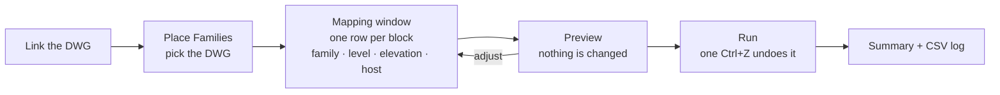

# CAD2Revit Family Mapper

[](https://github.com/ahmedel0865-lab/CAD2Revit-Family-Mapper/actions/workflows/build.yml)


**Turn the blocks in a linked DWG into real Revit families, in one window.**
Built for electrical / MEP shop drawings (lighting, power, fire alarm, ELV). It's a standalone Revit add-in, so no pyRevit, Dynamo or Excel is needed.

Instead of placing hundreds of light fixtures, sockets and detectors by hand over a CAD background, you map each CAD block to a Revit family type once. The tool places every instance at the right location, rotation, level and height, hosted on ceilings, walls or reference planes as you choose.


```mermaid
flowchart LR
    A[Link the DWG] --> B[Place Families<br/>pick the DWG]
    B --> C[Mapping window<br/>one row per block<br/>family · level · elevation · host]
    C --> D[Preview<br/>nothing is changed]
    D -->|adjust| C
    D --> E[Run<br/>one Ctrl+Z undoes it]
    E --> F[Summary + CSV log]
```

## Contents
- [The CAD2Revit ribbon](#the-cad2revit-ribbon)
- [Features](#features)
- [Requirements](#requirements) · [Installation](#installation) · [Quick start](#quick-start)
- [Ceiling vs Slab vs Reference Plane](#ceiling-vs-slab-vs-reference-plane-which-host-to-use)
- [Mapping file](#mapping-file) · [Project structure](#project-structure) · [Building from source](#building-from-source)
- [Performance](#performance) · [Limitations](#limitations-short) · [Roadmap](#roadmap)
- Guides: [Usage](docs/USAGE.md) · [Testing on a sample](docs/TESTING.md) · [Limitations](docs/LIMITATIONS.md) · [Changelog](CHANGELOG.md)

## The CAD2Revit ribbon

| Panel | Button | What it does |
|---|---|---|
| Mapper | **Place Families** | Pick the DWG, then map, preview and place everything in the mapping window. |
| Tools | **Settings** | Opens `settings.ini` (tolerances, host search distances, fallbacks) in Notepad. |
| Tools | **Help** | Version, user guide, and quick links to the logs and the saved project mappings. |

## Features

**Mapping window**
- **2D symbol preview**: hover over or select a block to see its CAD symbol, size and count before you pick a family.
- One row per unique CAD block (e.g. `SMOKE-DET (42)`), **grouped by category**: Electrical, Mechanical, Plumbing, Architectural, Structural, Annotation, Other.
- **Find** box and **Show** filter; **Skip shown rows** hides e.g. all architectural blocks in one click.
- **Searchable family dropdown** (electrical categories): type part of a name to filter.
- **Revit Family starts at `(Skip)`** every time the tool opens, so you pick the families for this run yourself. **Auto-match** pre-selects families whose names match the block name (`SMOKE-DET` → *Smoke Detector*, common CAD abbreviations included) when you click it, and **Clear All Families** sets every row back to `(Skip)`.
- **Level + elevation per row**: different blocks can go on different levels in one run.
- **Edit many rows at once**: select rows (Ctrl/Shift+click, Ctrl+A) and set Host Type, Level, Elevation, Facing or Category together.
- Groups the per-instance block names of **DWGs exported from Revit** (`Family - Type-<id>-<view>`) into one row per type.
- **Remembers per project** Elevation From Level, Host Type, Rotation, Facing, Level and the Slab (above) / Ceiling search range and fallback height, but not the families. Load / Save mappings as **.xlsx or .csv**; **Load...** is the only way families are filled in from a file.

**Placement and hosting**
- Places families at the block insertion points with the CAD rotation (plus a per-row adjustment). DWG units, link position, rotation and shared coordinates are handled automatically.
- Hosts per row: **None (level-based)**, **Ceiling**, **Slab (above)**, **Slab (below)**, **Wall**, **Reference Plane (auto-create)**, **Face** (ceilings/slabs/roofs/beams) or **Vertical plane** (no wall needed), including hosts in linked Revit models.
- **Wall** hosting puts the family on the wall face **on the side the CAD block is drawn**, at the CAD point projected onto that face, flat on the wall and facing out towards the block. The CAD rotation is ignored; the wall direction is used, including on curved walls. The nearest wall within the **Wall search distance** (500 mm, set in the window) at the row's height is used, in this model and in links. Blocks with no wall in range, moved more than 200 mm to reach the face, or on a wall in a link are listed in **Needs Review**.
- **Vertical plane** placement:
  - Each block gets its own vertical reference plane `CAD2Revit_V_<Level>_<n>`. It runs through the block's insertion point along the block's X direction, facing the block's +Y, from the level up to level + 3000 mm.
  - A plane is reused only if the block lies on it (within 5 mm) and faces the same way (within 0.5°).
  - The family goes on the block point at level + elevation, facing the block. If it lands more than 10 mm off, it is moved back. If it still can't be corrected, it is listed in **Needs Review**.
- **Final distance check, all host types**: any element placed farther than the **review distance** (50 mm, set in the window) from its CAD block is listed in **Needs Review** as "Placed N mm away from CAD block", with its Element ID.
- **Slab (above)**: hosts on the **bottom face of the nearest slab or beam above** each block, facing down, keeping the CAD rotation (sloped slabs included). Floors, roofs (sloped slabs are often modelled as roofs) and Structural Framing (beams) count, in this model and in linked models; ceilings and ducts are ignored. Whichever bottom face is closest above the point wins, so a drop beam under the slab is chosen over the slab. A beam is only used where the point is under its bottom face; otherwise the next host up is used. The search goes from the row's level up to the **Slab search range** (default 5000 mm), never higher, even if the level above is higher. **No slab or beam in range** (open area, slab opening, missing structural link): the family goes on one reference plane per level, `CAD2Revit_<Level>_+3000mm`, facing down, at the **Fallback reference plane height** (default 3000 mm). Level-based families are placed level-based at that Elevation From Level. Each such block is logged as `No slab/beam within 5000 mm - placed on reference plane at +3000 mm`, and its **Comments** get `CAD2Revit: Host = Reference Plane`, so you can find it later with a filter or schedule. Both values are at the top of the mapping window and are saved with the mapping. A level-based family under a slab or beam is placed level-based at its underside height.
- **Ceiling**: works the same way as Slab (above) and uses the same search code. It hosts on the **bottom face of the nearest ceiling above** each block, in this model and in linked (architectural) models, within the same search range. With no ceiling in range (no ceiling there, an opening, a missing architectural link), it uses the same fallback plane `CAD2Revit_<Level>_+3000mm`, or level-based at that height, logged as `No ceiling within 5000 mm - placed on reference plane at +3000 mm`, with the same Comments text. The two values at the top of the mapping window (*Search range* and *Fallback reference plane height*) apply to both Slab (above) and Ceiling.
- **Counts**: Preview and the result window show how many Slab (above) blocks were hosted on a slab, hosted on a beam, put on the reference plane, or placed level-based, and how many Ceiling blocks were hosted on a ceiling, put on the reference plane, or placed level-based.
- **Needs Review** window: after a run, every Slab (above) and Ceiling element that went on the fallback plane (or level-based fallback) is listed with Element ID, Family : Type, CAD Block, X, Y (mm) and Reason. Clicking a row selects the element in Revit and zooms to it. **Select All in Revit**, **Copy IDs** (comma-separated, for Manage > Select by ID) and **Export to Excel** are there too. **Slab (below)**: hosts on the **top of the slab** at the level, facing up (floor boxes). Where a block sits over a slab opening, the family goes on a reference plane at the slab's height, with a warning.
- **Detected Host (Preview)** column: after Preview, every row shows the host it would use, e.g. `Floor: 250mm RC Slab - Third Floor (linked: STR.rvt)`.
- **Reference Plane (auto-create)**: named horizontal planes at level + elevation (e.g. `CAD2Revit_Level 1_+2800mm`), shared per elevation, facing Down or Up.
- If no host is found, falls back to unhosted placement (or reports a failure, your choice).

**Safety and output**
- **Preview** runs the full placement and undoes it, so its counts match a real run.
- **Duplicate protection** per level: before a Run, if elements are already at the block locations (same family, or Comments `CAD: <block>`), the tool asks *"X elements already exist at these locations"*: **Skip them** (default), **Place anyway** or **Cancel**.
- **One transaction**: a single Ctrl+Z undoes a whole run.
- **Fast on big drawings**: hosts are found from face/wall indexes built once (not one ray per block), and level-based families are created in batches. A progress bar with **Cancel** is shown (Cancel rolls everything back), and a **Timings** table shows where the time went. See [Performance](#performance).
- Summary per family type, unmapped blocks and failures with reasons; a **CSV log** of every block with Element ID, level, host, coordinates and rotation.
- Writes `CAD: <block name>` into each element's Comments, for filters and schedules.

## Requirements
- Autodesk Revit **2022, 2023, 2024, 2025 or 2026** on Windows
- Nothing else: no pyRevit, no Dynamo, no Excel

## Installation
1. Download **`CAD2Revit-<version>.zip`** from the [download](download/) folder, the [Releases](https://github.com/ahmedel0865-lab/CAD2Revit-Family-Mapper/releases) page, or the latest run in the [Actions](https://github.com/ahmedel0865-lab/CAD2Revit-Family-Mapper/actions) tab (*Artifacts*).
2. Close Revit, unzip, and double-click **`Install.bat`**. It installs for every Revit 2022–2026 on the PC, for the current user; no admin rights are needed.
3. Start Revit and click **Always Load** when asked about the add-in. A **CAD2Revit** tab appears.

Uninstall: `Uninstall.bat`. Manual install and details: [docs/USAGE.md](docs/USAGE.md#0-install-once).

## Quick start
1. Load your families (face-based for hosted devices) and link the DWG in the target floor plan.
2. **CAD2Revit > Place Families** > pick the DWG > **Next**.
3. In the mapping window, pick a family for each CAD block (type to search; click **Auto-match** to pre-select close matches, or **Load...** a saved mapping), set the level, elevation and Host Type (see [Ceiling vs Slab vs Reference Plane](#ceiling-vs-slab-vs-reference-plane-which-host-to-use)). To set many rows at once, select them (Ctrl/Shift+click, Ctrl+A) and use *Apply to selected rows*; and leave `(Skip)` for blocks you don't want.
4. **Preview** > check the result and the *Detected Host* column > **Run**. One Ctrl+Z undoes it all.

Next time in the same project, the mapping window remembers elevations, host types, rotation, facing and levels. Every Revit Family starts at `(Skip)`, so you only re-pick the families (or use **Load...**).

- Full guide: [docs/USAGE.md](docs/USAGE.md)
- Test on a small sample first: [docs/TESTING.md](docs/TESTING.md)
- Known limitations: [docs/LIMITATIONS.md](docs/LIMITATIONS.md)
- Example mapping: [templates/mapping_template.xlsx](templates/mapping_template.xlsx) / [.csv](templates/mapping_template.csv)

## Ceiling vs Slab vs Reference Plane: which host to use?

**Slab (above)** fits when devices hang from the **structural slab soffit**: exposed or open ceilings, car parks, plant rooms, or wherever the ceilings aren't modelled yet but the structural model is linked. Devices follow the slab: if the structure changes, re-running finds the new soffit. **Slab (below)** is the same for floor boxes and floor sockets on top of the slab. The table below compares Ceiling and Reference Plane.

| Use **Ceiling** when... | Use **Reference Plane (auto-create)** when... |
|---|---|
| The model (or a linked architectural model) **has ceilings** at the right height. | There are **no ceilings** yet, or they are in a model you can't host on (e.g. a DWG background only). |
| You want devices to **follow the ceiling**: if the architect moves the ceiling, hosted lights and detectors move with it. | You want a **fixed height** from the level that you control, e.g. 2800 mm for all lights on Level 1, regardless of the architecture. |
| Ceilings are at different heights in different rooms, and each device should sit on its own ceiling. | Many devices share one height and you want **one tidy plane per height** that you can move later (moving the plane moves every device on it). |
| | Devices go on the **underside of a slab** or in **open ceilings** (car parks, plant rooms), or **face up** on the floor (floor boxes: set *Facing* = Up). |

Notes:
- All three need **face-based** (or work-plane-based) families. A level-based family set to Reference Plane is placed level-based at the elevation, with a warning in the log and the result window. On Slab (above) and Ceiling rows it is placed level-based at the host's underside height, or at the fallback height when there is no host. On Face / Slab (below) rows it is not placed ("family is not face-based").
- For hosts in **linked models**, each placed instance is checked: *Host* must be the link, not a reference plane. Otherwise the block is reported as failed. Set `DebugHosting = true` in `settings.ini` to get a per-block DEBUG line (link, element, normal, final host) in the log.
- Ceiling hosting looks straight up from each block for a ceiling within the search range (default 5000 mm). Anything without a ceiling above it goes on the fallback reference plane (default +3000 mm) and is listed in **Needs Review**.
- Reference planes are named `CAD2Revit_<Level>_+<elevation>mm` (`..._Up` for up-facing ones). They cover the DWG extents and are reused by later runs. The planes created in a run are removed by the same Ctrl+Z.

## Mapping file
The mapping window can **Load / Save** the mapping as a file, to reuse it across projects or share it with the team. Empty family = Skip:

| CAD_Block_Name | Revit_Family_Name | Revit_Type_Name | Offset_From_Level_mm | Rotation_Adjustment_deg | Host_Type |
|---|---|---|---|---|---|
| LIGHT-600x600 | Recessed Panel Light | 600x600 40W | 2800 | 0 | ceiling |
| SOCKET-DOUBLE | Duplex Receptacle | Standard | 300 | 0 | wall |
| SMOKE-DET | Smoke Detector | Ceiling | 2800 | 0 | ceiling |
| DB-PANEL | Lighting and Appliance Panelboard | 400A | 1500 | 180 | non-hosted |
| FLOOR-BOX | Floor Box | Standard | 0 | 0 | slab below |

`Host_Type` values: `non-hosted`, `ceiling`, `slab above`, `slab below`, `wall`, `reference plane`, `face` or `vertical`. The window's labels are accepted too.

Saved mappings also carry two columns, `Slab_Search_Range_mm` and `Slab_Fallback_Plane_mm`, with the same value on every row (the Slab (above) values from the top of the mapping window). Files without them use 5000 and 3000.

## Project structure
```
addin/                            standalone Revit add-in (C#)  <- main product
  src/CAD2Revit/                  Revit add-in
    App.cs                        ribbon: Mapper (Place Families), Tools (Settings, Help)
    Commands/                     the three ribbon commands
    Revit/                        DWG reader, host finder, reference/vertical planes, placer
    UI/                           mapping window (WPF), step-1 dialog, result window
  src/CAD2Revit.Core/             Revit-free logic (unit tested): CSV/XLSX, mapping, name
                                  matching, block names & categories, report, settings
  tests/CAD2Revit.Core.Tests/     unit tests (run without Revit)
  package/                        .addin manifest, Install.bat, install.ps1
  tools/package.sh                build all Revit versions + zip
templates/                        mapping_template.xlsx / .csv
docs/                             USAGE.md, TESTING.md, LIMITATIONS.md
```

## Building from source
Needs the .NET 8 SDK (Windows, macOS or Linux). Revit does not need to be installed; the Revit API reference assemblies come from the `Nice3point.Revit.Api` NuGet packages.
```
cd addin
dotnet test tests/CAD2Revit.Core.Tests          # unit tests
dotnet build src/CAD2Revit -c Release -p:RevitVersion=2024   # one Revit version
bash tools/package.sh                           # all versions -> dist/CAD2Revit-<version>.zip
```
Or open `addin/CAD2Revit.sln` in Visual Studio 2022. Pushing a tag like `v0.4.0` makes CI publish the zip as a GitHub Release.

## Performance

Every Preview/Run ends with a **Timings** table in the result window (also in the CSV log, rows with Status `timing`). It shows the time per phase: DWG reading, host detection, duplicate check, creation, rotation, parameters and commit.

What v0.12 changed, **for 1,000 blocks** (counts of Revit API work, from the code):

| Work | v0.11 | v0.12 |
|---|---|---|
| Slab / ceiling / face host detection | 1,000 ray casts (`ReferenceIntersector.Find`) | host geometry read **once** + 1,000 in-memory lookups |
| Wall host detection | up to **16,000** rays (16 per block) | location-line index lookup, then plan math on the 1–2 nearest walls (side, projection, tangent); face offsets computed once per wall |
| Level-based creation | 1,000 `NewFamilyInstance` + up to 1,000 `RotateElement` | **one** `NewFamilyInstances2` per mapping row and level, rotation included |
| Regenerations | 1 per reference-plane block, plus 1 per newly activated type | **1**, before the loop |
| Duplicate grid | rebuilt from all instances for every level used | built **once** |
| DWG geometry | Fine detail | Coarse detail |

Measured without Revit (`addin/src/CAD2Revit.Core`, .NET 8, 1,000 random block points):
- face index over 400 slab bays with openings: built in about 5–8 ms, and 1,000 lookups take about 3 ms;
- duplicate grid of 20,000 existing instances: built in about 25–40 ms, and 1,000 queries take about 2 ms.

Wall-clock times inside Revit depend on the model and haven't been measured yet (Revit can't run in the build environment). Run a Preview on your drawing, and the Timings table gives the numbers for your project. Please share them so this section can list real before/after times.

## Limitations (short)
- **Block attributes** (circuit number, panel name, etc.) are not readable through the Revit API, so they are not copied yet.
- **Anonymous dynamic blocks** (`*U123`) and **exploded blocks** cannot be mapped.
- **Mirrored** blocks are placed with rotation only and flagged in the log.
- **Legacy (non face-based) hosted families** cannot host on linked models. Use face-based families.

See [docs/LIMITATIONS.md](docs/LIMITATIONS.md) for details and workarounds.

## Roadmap
- [x] Excel (.xlsx) mapping support
- [x] Wall-hosted placement (sockets, switches)
- [x] Standalone Revit add-in (no pyRevit)
- [x] In-Revit mapping window with searchable families and per-project memory
- [x] Slab soffit / slab top hosting, including structural links
- [ ] Copy block attributes via an AutoCAD Data Extraction CSV matched by location
- [ ] Auto-assign circuits / panel parameters
- [ ] Save and reuse mapping profiles per project
- [ ] Multiple DWGs / levels in one run

## Contributing
Issues and pull requests are welcome. Please test changes on a copy of a model and include the Revit version you tested with.

## License
[MIT](LICENSE)
